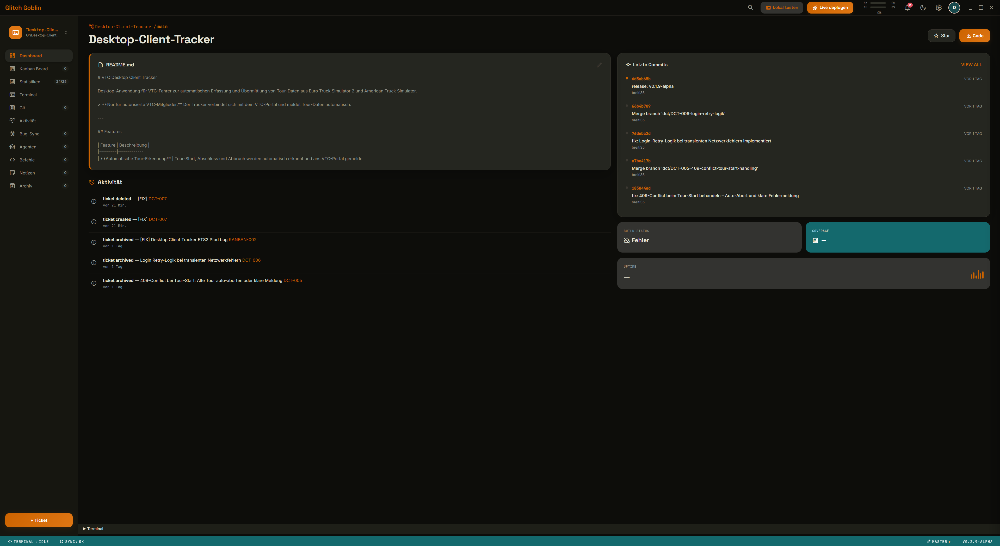
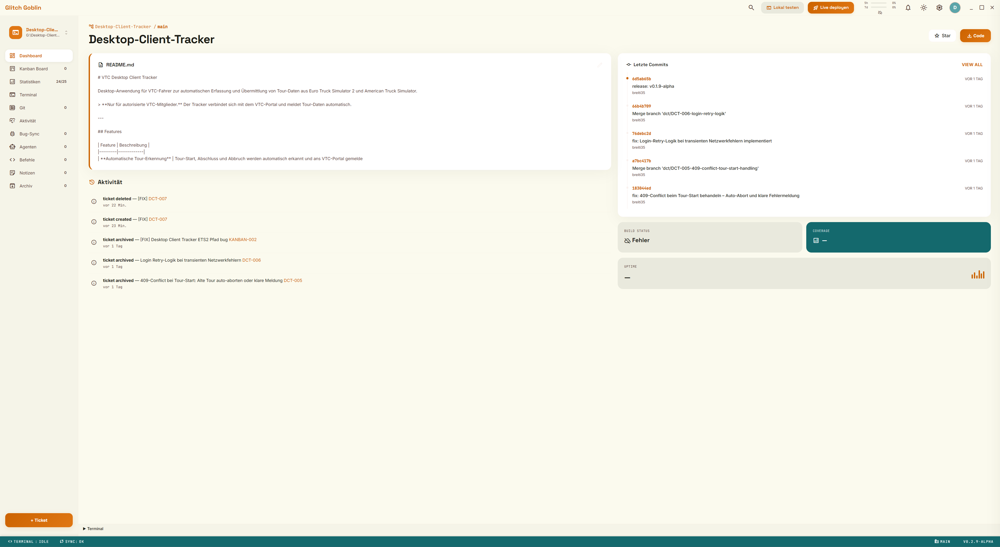

<p align="center">
  
</p>

<h1 align="center">Glitch Goblin</h1>

<p align="center">
  Desktop-Kanban-Board fuer Entwicklungsprojekte mit integriertem Terminal, Git-Workflow und Claude Code Integration.
  <br>
  <strong>Windows &bull; Linux</strong>
</p>

<p align="center">
  <a href="https://github.com/breiti35/Glitch-Goblin/actions"></a>
  <a href="https://github.com/breiti35/Glitch-Goblin/releases/latest"></a>
  
  
</p>

---

## Features

- Kanban Board mit Drag-and-Drop, Fokus-Modus und Ticket-Archivierung
- Integriertes Terminal mit Multi-Tab und konfigurierbarer Shell
- Git-Integration: automatische Branches, Review-Diffs, Merge-Workflow
- Claude Code Integration mit Kontingent-Anzeige und Token-Tracking
- Multi-Projekt-Verwaltung mit Dashboard und Statistiken
- Dark / Light Theme
- Import/Export, Templates, Backups

<details>
<summary><strong>Light Theme</strong></summary>
<p align="center">
  
</p>
</details>

---

## Installation

### Download

Fertige Builds (Windows Installer + Portable, Linux AppImage) gibt es unter [Releases](https://github.com/breiti35/Glitch-Goblin/releases/latest).

### Aus dem Quellcode bauen

Voraussetzungen: [Rust](https://rustup.rs/) (stable), [Node.js](https://nodejs.org/), Tauri CLI (`cargo install tauri-cli`)

```bash
git clone https://github.com/breiti35/Glitch-Goblin.git
cd Glitch-Goblin
cargo tauri dev       # Development
cargo tauri build     # Release Build
```

---

## Schnellstart

1. **Projekt hinzufuegen** — Projektordner auswaehlen (muss ein Git-Repository sein)
2. **Ticket erstellen** — `Ctrl+N` oder [+] im Backlog
3. **Starten** — Erstellt Branch, oeffnet Fokus-Modus mit Terminal
4. **Abschliessen** — Review-Diff, dann Commit
5. **Mergen** — Branch in Hauptbranch uebernehmen

---

## Lizenz

[MIT](LICENSE) — Copyright (c) 2026 breiti35
